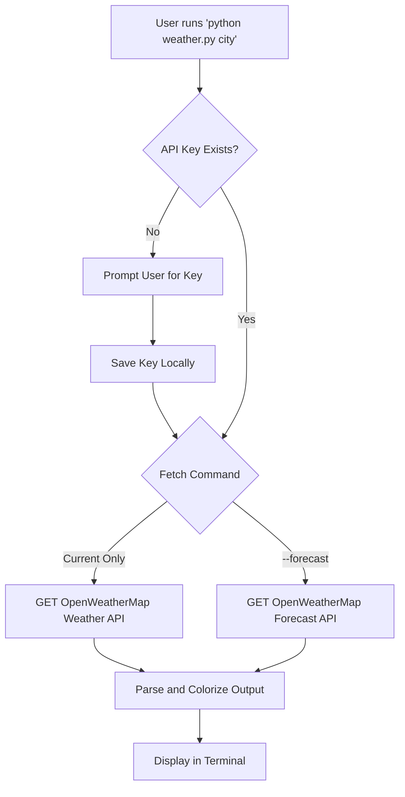

# Weather CLI

A beautiful, lightweight command-line tool for checking current weather conditions and forecasts directly from your terminal. Built with Python and utilizes the OpenWeatherMap API.

This project was built to demonstrate command-line application structure, API integrations, and formatted terminal output in Python. It's a handy tool for developers who want to check the weather without leaving their terminal workspace.

## Features

- **Current Weather:** Get temperature, humidity, wind speed, pressure, and visibility
- **Terminal Aesthetics:** Fully colorized output with terminal-friendly weather emojis
- **Forecast:** Optional 24-hour forecast in a clean, readable table format
- **Easy Setup:** Simple interactive setup for configuring your API key
- **Fast:** Lightweight script that fetches and displays data instantly

## How It Works



## Getting Started

### Prerequisites

- Python 3.6 or higher
- pip (Python package list manager)

### Installation

```bash
git clone https://github.com/Darkshaz/weather-cli.git
cd weather-cli
pip install -r requirements.txt
```

### Initial Setup

Before using the tool for the first time, you need a free API key from OpenWeatherMap.

1. Go to https://openweathermap.org/api and sign up for a free account
2. Generate an API key
3. Run the setup command:

```bash
python weather.py --setup
```

The tool will securely save your key to your home directory (`~/.weather_cli_key`).

## Usage

Check the weather for any city:

```bash
python weather.py London
```

For cities with spaces in the name, use quotes:

```bash
python weather.py "Kuala Lumpur"
```

Include a 24-hour forecast:

```bash
python weather.py Tokyo --forecast
```

View the help message:

```bash
python weather.py --help
```

## Tech Stack

- **Language:** Python
- **Libraries:** Requests (for API calls)
- **Formatting:** ANSI color codes, text manipulation

## License

MIT License
